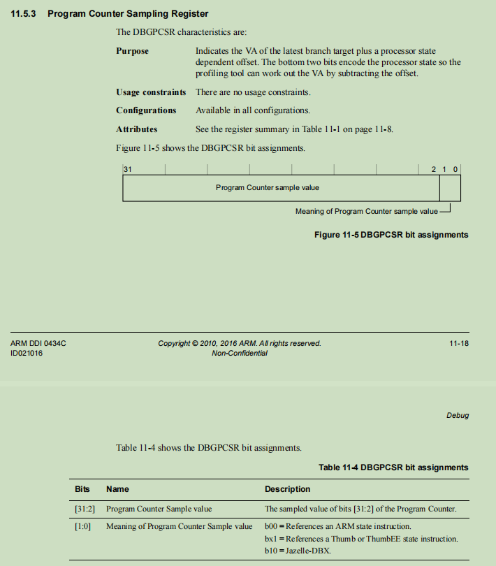

# a5_pc_read 

需要使用 jtag

## jtag 方式
```bash
# fuse.MP0.MP0_CPU_DBG_SEL=0x1
j_fuse 0x4 0x1

# axi read 0x30400a0
j_axi 0x30400a0

# The sampled value of bits [31:2] of the Program Counter
read val = 0x00005CC5

a5_pc = 0x5CC0

```

## DCUTune 方式 enable DBG_SEL
```bash
# MP0.MP0_CPU_DBG_SEL=0x1
./DCUTune -rpp=0x3200050
./DCUTune -wpp=0x3200050,0x1
```


