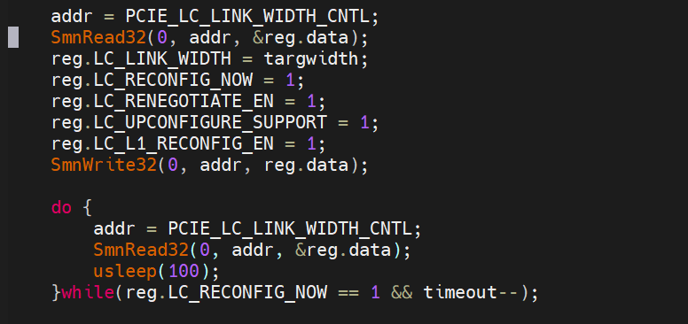
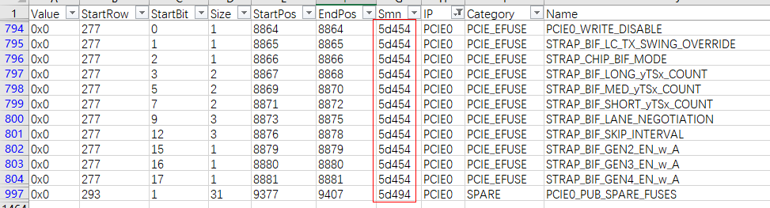

# fuse km

## harvest

### KM GC_DEBE

128CU harvet 分别对应 DEBE_0 ~ DEBE_4: 24,32,32,32,8

| CU   | FUSE                       | Smn >> 2        |
| ---- | :------------------------- | --------------- |
| 32   | DEBE_0[8:31],DEBE_1[0:7]   | DEBE_0: 0x174A0 |
| 32   | DEBE_1[8:31],DEBE_2[0:7]   | DEBE_1: 0x174A1 |
| 32   | DEBE_2[8:31],DEBE_3[0:7]   | DEBE_2: 0x174A2 |
| 32   | DEBE_3[8:31],DEBE_4[19:26] | DEBE_3: 0x174A3 |
|      |                            | DEBE_4: 0x174A4 |

smn addr(0x5d280~0x5d294) >> 2 = 0x174A0~0x174A5

| Value | StartRow | StartBit | Size | StartPos | EndPos | Smn   | IP   | Category | Name   |
| ----- | -------- | -------- | ---- | -------- | ------ | ----- | ---- | -------- | ------ |
| 0x0   | 160      | 8        | 32   | 5128     | 5159   | 5d280 | GC   | GC_DEBE  | DEBE_0 |
| 0x0   | 161      | 8        | 32   | 5160     | 5191   | 5d284 | GC   | GC_DEBE  | DEBE_1 |
| 0x0   | 162      | 8        | 32   | 5192     | 5223   | 5d288 | GC   | GC_DEBE  | DEBE_2 |
| 0x0   | 163      | 8        | 32   | 5224     | 5255   | 5d28c | GC   | GC_DEBE  | DEBE_3 |
| 0x0   | 164      | 19       | 32   | 5267     | 5298   | 5d290 | GC   | GC_DEBE  | DEBE_4 |
| 0x0   | 165      | 19       | 32   | 5299     | 5330   | 5d294 | GC   | GC_DEBE  | DEBE_5 |

fuse_override 0xa0 val[8:31] # DEBE_0
fuse_override 0xa1 val[0:31] # DEBE_1
fuse_override 0xa2 val[0:31] # DEBE_2
fuse_override 0xa3 val[0:31] # DEBE_3
fuse_override 0xa4 val[19:26] # DEBE_4
fuse_override 0xa5 val[19:32] # DEBE_5
fuse_override 0xa6 val[0:19] # GC_PUB_SPARE_FUSES

#### km vbios fuse 2 reg
0x15c
0x160
0x164
0x168

# X8 mode

## romstrap
only usefull for EP
0x5 -> x16 
0x4 -> x12
0x3 -> x8
0x5	34	21	3	1109	1111	1100088	nbif_vega20c_gpu	RCC_DEV0_PORT_STRAP0	STRAP_BIF_STRAP_MAX_LINK_WIDTH_SUPPORT_DEV0

## x8 vbios config

# fuse Distribute (PCIE0)

## SOC_FUSEDOC

## PubFuseAddress
PCIE0 : 0x75257515
PubFuseAddress start = 0x7515 << 2 | 0x5D000  (0x5d454)
PubFuseAddress end  = 0x7525 << 2 | 0x5D000  (0x5d494)

MP0 Write PubFuseAddress to PCIE0_RSMU_PUB_FUSE_ADDR_GENERIC