rm -rf /etc/profile.d/hygon-env.sh 
echo "blacklist hydcu" > /etc/modprobe.d/blacklist-hydcu.conf

# cretest
source 脚本后
cool_reset_tp_tester
Stil2Tcl_run

telnet 192.168.1.199 4444
>
select_die0
source jar.tcl_new
SELECTDIE
source ate脚本
enable_smn
cool_reset_tp_tester
Stil2Tcl_run

cool_reset_tp_tester
source ate脚本
enable_smn
cool_reset_tp_tester
Stil2Tcl_run

# pcei crest

```bash
jtag cmd:
#fuse_load proto_dvt_clk.hex
source ate_fuse.override.tcl
ate_fuse_set
cool_reset_tp_tester
source ate_crest_commom.tcl
enable_smn
Stil2Tcl_run

host cmd:
/root/dcu_pts/tools/misc/hydcusmutool frequency -d 0 -c 0 -m 2 -f 600
/root/dcu_pts/tools/misc/hydcusmutool voltage -d 0 -p 0 -m 2 -V 0.65
/root/dcu_pts/tools/misc/hydcusmutool monitor --board_type 1
python crest_run.py pcie_crest_cpc_cu_smn.stil.tdr.txt

```

# 基本型号
SMN 0x5d44c


# baco reset
/home/ray/bin/dcu_smnwr 0 0x59A04 0x40c
/home/ray/bin/dcu_smnwr 0 0x59A04 0x404

# 7390
CPU BIOS: MR

# v06
unitest case delete:
 - UTAPI/ITTest/gfxhub/it_gfxhub_multistage_pt_test.py::test_gfxhub_multistage_pt_4_t003
 

# linux 将mount /dev/sda4 /mnt/ 设置到开启启动中
您可以将该挂载配置添加到 /etc/fstab 文件中，以便每次开机时自动挂载。
要编辑 /etc/fstab 文件，您可以使用任何文本编辑器，例如 nano：
`sudo nano /etc/fstab`
然后在文件底部添加一行类似于以下内容的条目：
`/dev/sda4 /mnt ext4 defaults 0 2`
这个条目的含义是：将设备 /dev/sda4 挂载到目录 /mnt，使用 ext4 文件系统，并使用默认选项进行挂载。最后两个数字 0 2 分别指定了备份和自检的顺序。
保存并退出 /etc/fstab 文件后，您可以重新启动系统以使更改生效。之后，您应该会发现设备 /dev/sda4 已经成功地挂载到目录 /mnt 中。


# slt_km
http://172.18.228.101:9900/zifang/radeonopencompute/rock-kernel-refactory.git
## V05 F2 水冷 SMU-avfs
!!!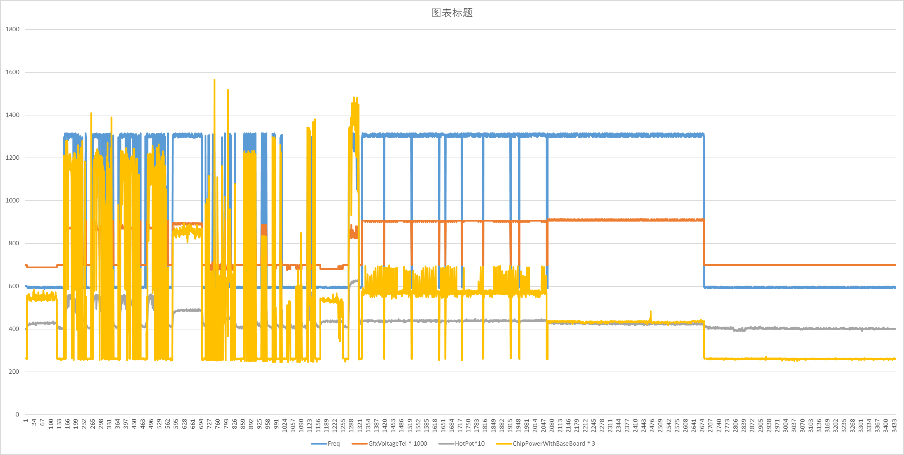

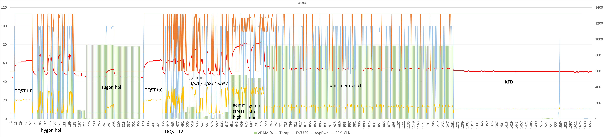


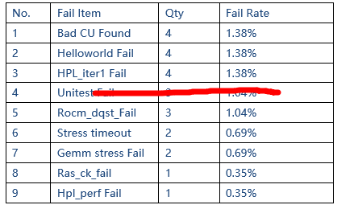


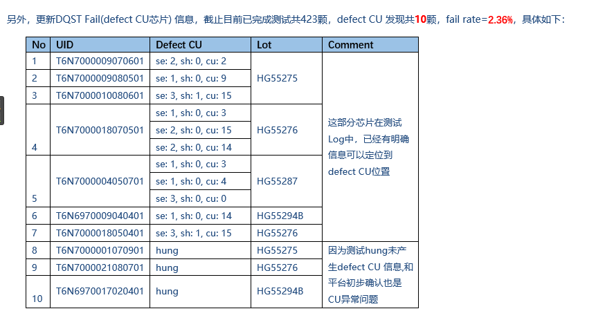


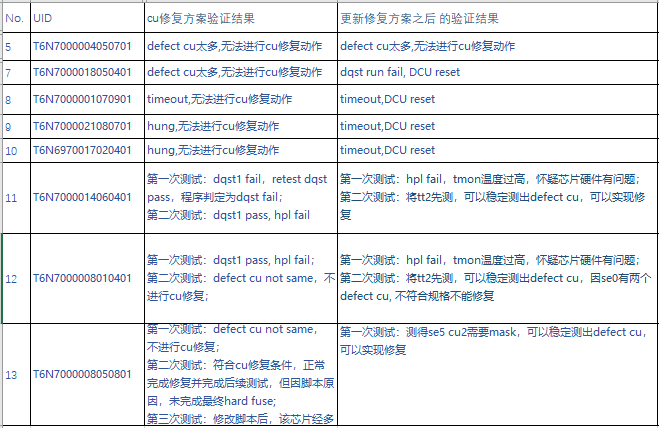

* [ ] 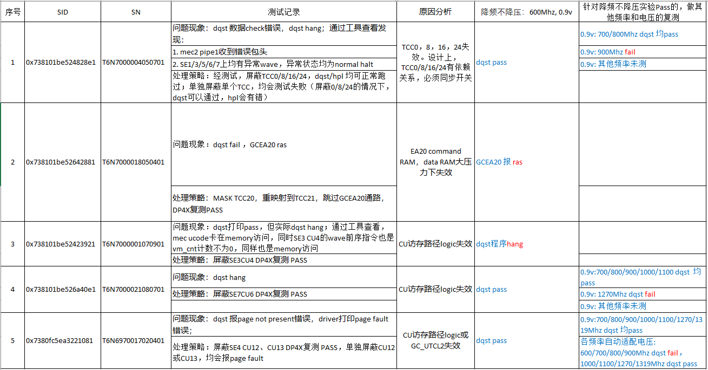
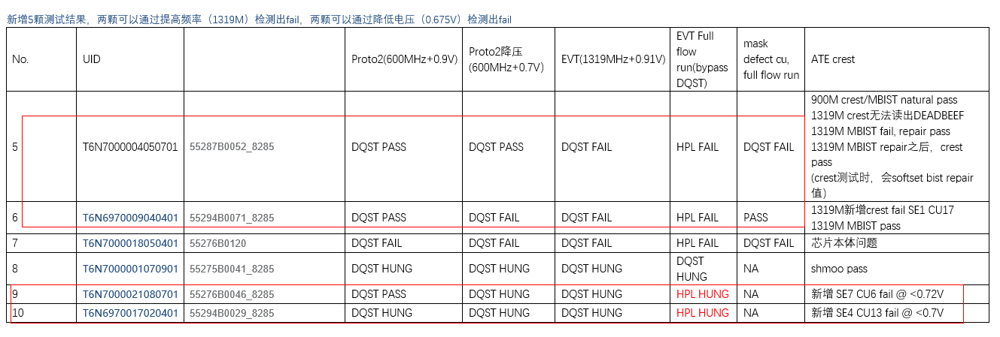

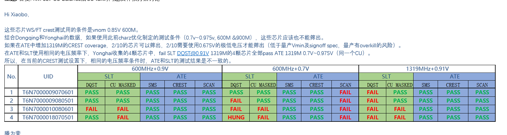

 29 颗      

  
|       <br>       |       <br>       |       <br>       |              <br>               |     <br>      |           <br>            |             <br>             |
| ---------------- | ---------------- | ---------------- | ------------------------------- | ------------- | ------------------------- | --------------------------- |
| UnitID           | SN               | category         | MASKED CU                       | ATE failed IP | 　                         |                              |
| T6N6970017050101 | 55202B0004\_8285 | 120CU16TCC       | TCC.29                          | SCAN          | 正常                       |                              |
| T6N6970014070901 | 55202B0003\_8285 | 120CU16TCC       | TCC.5                           | SCAN          | 正常                       |                              |
| T6N6970012080901 | 55202B0002\_8285 | 120CU16TCC       | TCC.9                           | SMS           | 正常                       |                              |
| T6N6970007010501 | 55202B0001\_8285 | 120CU16TCC       | TCC.29                          | SMS           | 正常                       |                              |
| T6N6970017070801 | 55200B0010\_8285 | 128CU SMS repair | NA                              | SMS           | 正常                       |                              |
| T6N6970017050801 | 55200B0009\_8285 | 128CU SMS repair | NA                              | SMS           | 正常                       |                              |
| T6N6970016060801 | 55200B0006\_8285 | 128CU SMS repair | NA                              | SMS           | SQ\_VGPR2,\[0\]\[6\],DED3 |                              |
| T6N6970016040701 | 55200B0008\_8285 | 128CU SMS repair | NA                              | SMS           | 正常                       |                              |
| T6N6970014050701 | 55200B0004\_8285 | 128CU SMS repair | NA                              | SMS           | 正常                       |                              |
| T6N6970010060701 | 55200B0001\_8285 | 128CU SMS repair | NA                              | SMS           | 正常                       |                              |
| T6N6970010050601 | 55200B0003\_8285 | 128CU SMS repair | NA                              | SMS           | 正常                       |                              |
| T6N6970008050601 | 55200B0002\_8285 | 128CU SMS repair | NA                              | SMS           | 正常                       |                              |
| T6N6970008030401 | 55200B0005\_8285 | 128CU SMS repair | NA                              | SMS           | 正常                       |                              |
| T6N6970008100301 | 55200B0007\_8285 | 128CU SMS repair | NA                              | SMS           | hpl 残值不对               |                              |
| T6N6970017090901 | 55198B0001\_8285 | 120CU32TCC       | SE.5.CU.6/SE.3.CU.13            | SMS &SCAN     | 正常                       |                              |
| T6N6970017110601 | 55198B0012\_8285 | 120CU32TCC       | SE.0.CU.11                      | SMS           | 正常                       | VGPR3 ded                    |
| T6N6970017080601 | 55198B0010\_8285 | 120CU32TCC       | SE.7.CU.1                       | SMS           | 正常                       |                              |
| T6N6970016090901 | 55198B0014\_8285 | 120CU32TCC       | SE.2.CU.4/SE.3.CU.5             | SMS &SCAN     | 正常                       |                              |
| T6N6970016070801 | 55198B0006\_8285 | 120CU32TCC       | SE.3.CU.5                       | SMS           | 正常                       |                              |
| T6N6970015040901 | 55198B0013\_8285 | 120CU32TCC       | SE.2.CU.8/SE.0.CU.6             | SMS &SCAN     | 驱动加载失败               | TA\_FS\_DFIFO sec,VGPR1 sec |
| T6N6970015090801 | 55198B0004\_8285 | 120CU32TCC       | SE.4.CU.5                       | SMS           | 正常                       |                              |
| T6N6970013080701 | 55198B0015\_8285 | 120CU32TCC       | SE.6.CU.0                       | SMS &SCAN     | 正常                       |                              |
| T6N6970012040501 | 55198B0009\_8285 | 120CU32TCC       | SE.6.CU.3                       | SMS           | 正常                       |                              |
| T6N6970012100401 | 55198B0003\_8285 | 120CU32TCC       | SE.1.CU.5/                      | SMS &SCAN     | 正常                       |                              |
| T6N6970010070801 | 55198B0002\_8285 | 120CU32TCC       | SE.0.CU.14/SE.3.CU.11/SE.4.CU.2 | SMS           | 正常                       | 有ras 但有多个cu上报          |
| T6N6970010020701 | 55198B0011\_8285 | 120CU32TCC       | SE.2.CU.4/SE.3.CU.4             | SMS           | 正常                       |                              |
| T6N6970010100701 | 55198B0005\_8285 | 120CU32TCC       | SE.1.CU.7/SE.7.CU.2/SE.3.CU.2   | SMS &SCAN     | 正常                       | 一个sec 一个残值不对 dqst报错 |
| T6N6970008040801 | 55198B0008\_8285 | 120CU32TCC       | SE.7.CU.13                      | SMS &SCAN     | 正常                       |                              |
| T6N6970007050801 | 55198B0007\_8285 | 120CU32TCC       | SE.3.CU.13                      | SMS           | 正常                       |                              |
      

FAIL INFO
  
|       <br>       |       <br>       |    <br>    |              <br>               |                   <br>                   |
| ---------------- | ---------------- | ---------- | ------------------------------- | ---------------------------------------- |
| T6N6970017110601 | 55198B0012\_8285 | 120CU32TCC | SE.0.CU.11                      | VGPR3 ded                                |
| T6N6970015040901 | 55198B0013\_8285 | 120CU32TCC | SE.2.CU.8/SE.0.CU.6             | TA\_FS\_DFIFO sec/VGPR1 sec              |
| T6N6970010070801 | 55198B0002\_8285 | 120CU32TCC | SE.0.CU.14/SE.3.CU.11/SE.4.CU.2 | 有ras 但有多个cu上报，三个cu屏蔽之后ras消失 |
| T6N6970010100701 | 55198B0005\_8285 | 120CU32TCC | SE.1.CU.7/SE.7.CU.2/SE.3.CU.2   | VGPR0 sec/残值不对/dqst报错                |

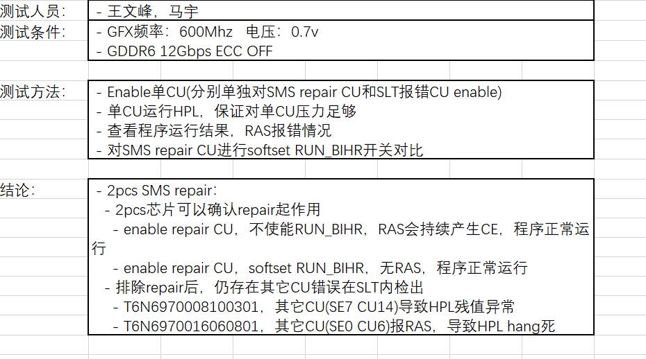


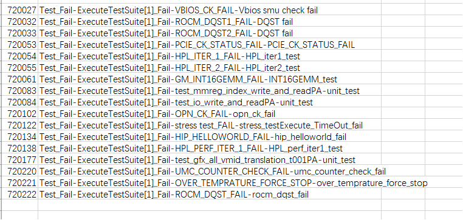
720027 Test Fail-ExecuteTestSuite[11 Fail-VBIOS CK FAIL-Vbios smu check fail
720032 Test Fail-ExecuteTestSuitel1] Fai-ROCM DOST1 FAIL-DOST fail
720033 Test Fail-ExecuteTestSuite[11 Fail-ROCM DOST2 FAIL-DOST fail
720053 Test Fai-ExecuteTestSuite[11 Fail-PCIE CK STATUS FAIL-PCIE CK STATUS FAIL
720054 Test Fail-ExecuteTestSuite[1] Fail-HPL ITER 1 FAIL-HPL iter test
720055 Test Fail-ExecuteTestSuitel1] Fail-HPL ITER 2 FAIL-HPL iter2 test
720061 Test Fail-ExecuteTestSuite[1] Fail-GM INT16GEMM FAIL-INT16GEMM test
720083 Test Fai-ExecuteTestSuitel11 Fail-test mmreg index write and readPA-unit test
720084 Test Fail-ExecuteTestSuitel1] Fail-test io write and readPA-unit test
720102 Test Fail-ExecuteTestSuite[1] Fail-OPN CK FAIL-opn_ck fail
720122 Test Fail-ExecuteTestSuitel1] Fail-stress test FAlL-stress testExecute TimeOut fail
720134 Test Fail-ExecuteTestSuitel11 Fail-HIP-HELLOWORLD FAIL-hip helloworld fai
720138 Test Fail-ExecuteTestSuitel1] Fail-HPL PERF ITER 1 FAlL-HPL perf iter1 test
720177 Test Fail-ExecuteTestSuite[11 Fail-test gfx all vmid translation_t001PA-unit test
720220 Test Fail-ExecuteTestSuitel11 Fail-UMC COUNTER CHECK FAIL-umc counter check fail
720221 Test Fail-ExecuteTestSuitel11 Fail-OVER TEMPRATURE FORCE STOP-over temprature force stop
720222 Test Fail-ExecuteTestSuite[11 Fail-ROCM DOST_FAlL-rocm dgst fail
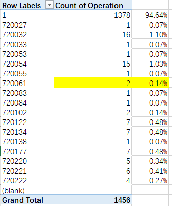