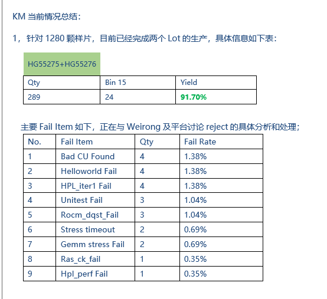
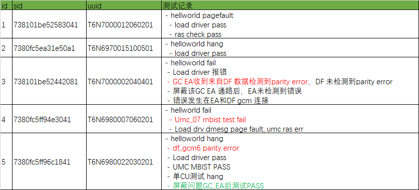
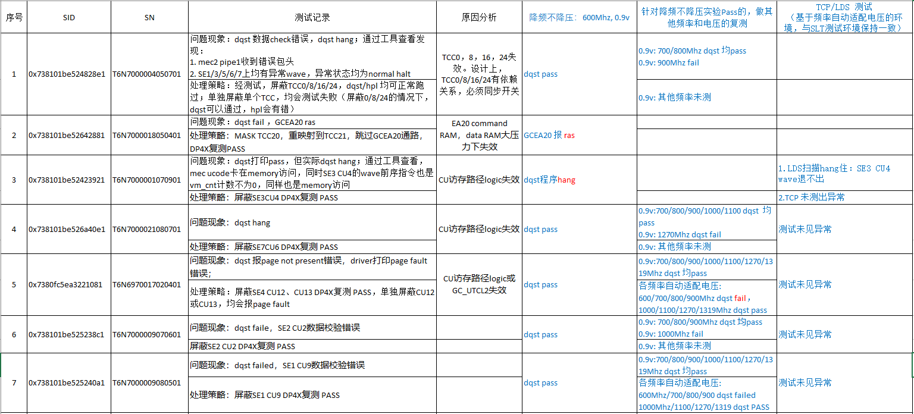
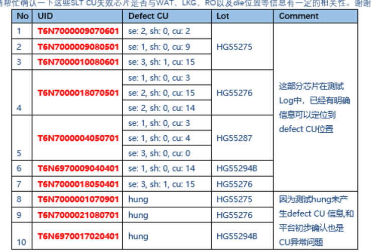

```bootcode run
# early boot
pt:0x06,20734000
pt:0x10,56011000

# late boot
pt:0x1b,69486000
pt:0x1e,86901000

# sboot
pt:0x64,      285539000
ps:0x12345678,1156304000
```


`for file in $(cat list.txt); do tail -n 1 $file; done`

insmod $ko_path/hydcu.ko dp4x_enable=1 dcu_powerplay_en=$1 disable_harvesting=1


`./DCUTune -wp=0x106c930,0x7ffc`
secure gasket的可以这样把NBIF的unlock, 以读写0x4b644

# 内网vbios编译
module load ds5/5.20.2

# tmp
## 固件测试

* vbios : dcurom.409831.8285.sign_encf.rel.bin
* smu enable
* gasket enable

### 确认mp1 run

`./DCUTune -i=0 -r=0x3b10024`
0x3b10024 = 0x1

```txt
==>> 102 d 0x10000014
==>> 103 d 0x10000015
```

### 确认secure gasket run

```txt
==>> 104 d 0x1000002A
==>> 105 d 0x88008800
==>> 106 d 0x88008801
==>> 107 d 0x88008802
==>> 108 d 0x88008803
==>> 109 d 0x88008804
==>> 110 d 0x1000002B
```






